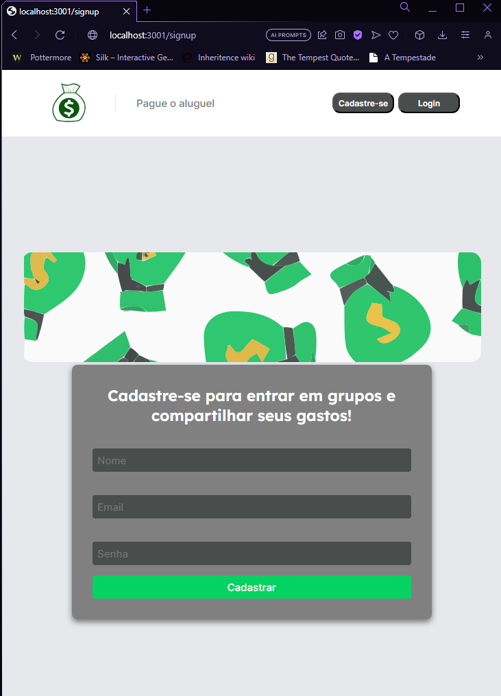
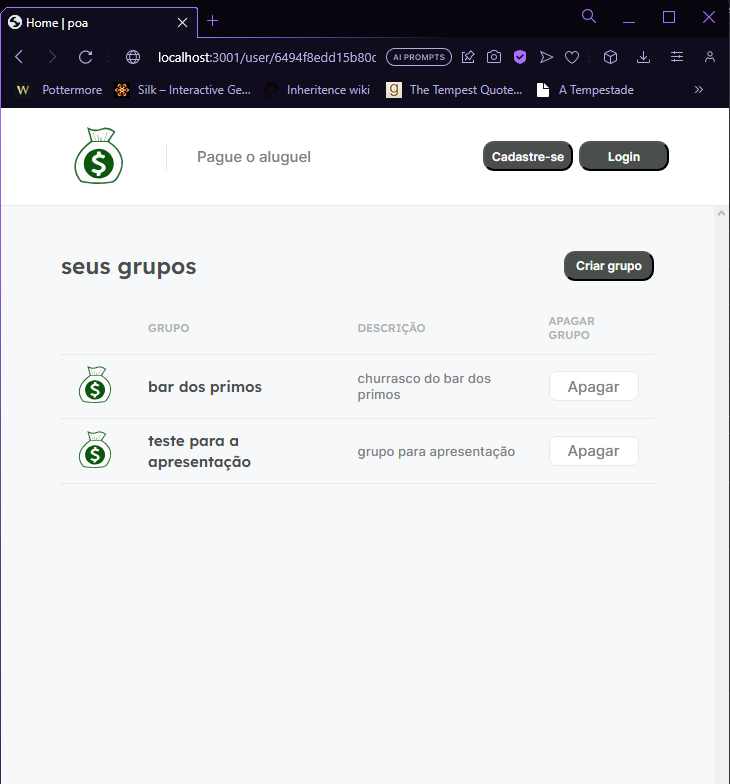
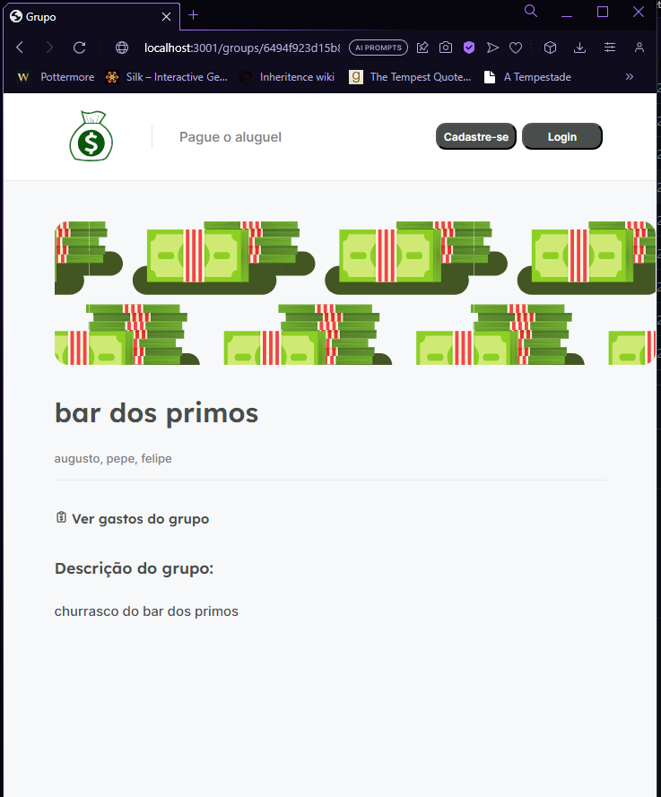
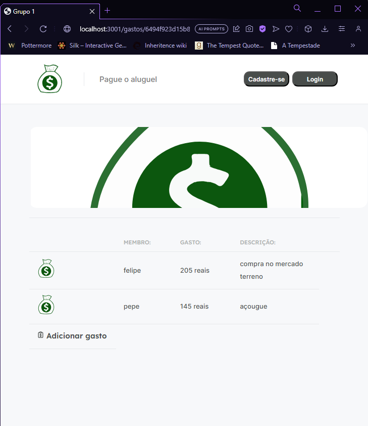

<h1 align="center">
  Pague o Aluguel
</h1>

<h4 align="center">✅ POA - funcional porém o código ainda não foi limpo nem refatorado! ✅</h4>
<br/>

## :information_source: Sobre o projeto:
A API utilizada no projeto está <a href="https://github.com/augustinho2/poa-API"> aqui <a/>
<br/>
<br/>


### Pré-requisitos
This is a [Next.js](https://nextjs.org/) project bootstrapped with [`create-next-app`](https://github.com/vercel/next.js/tree/canary/packages/create-next-app).

Antes de começar, você vai precisar ter instalado em sua máquina as seguintes ferramentas:

- [Git](https://git-scm.com/)
- [Visual Studio Code](https://code.visualstudio.com/)
- [Node](https://nodejs.org/en)


### Clonando repositório

Para clonar o repositório em algum lugar na sua máquina, basta utilizar o comando abaixo:
```bash
$ git clone https://github.com/augustinho2/Poa.git
```
### Iniciando a aplicação
Para ver a aplicação funcionando, abra o terminal do VsCode e digite o comando
```sh
yarn dev
ou
npm run dev
```

Abra [http://localhost:3000](http://localhost:3000) no seu browser
<br>
### Dependências de desenvolvimento
<br>

 
 
<br>
 
## :information_source: Imagens do projeto:
<br>
 Signup Screen:
<p align="center">
  
</p>
<br>
 Login Screen:
<p align="center">
  
</p>
<br>
 User Screen:
<p align="center">
  
</p>
<br>
 Group Screen:
<p align="center">
  
</p>
<br>
 expenses Screen:
<p align="center">
  
</p>
<br>
 Add expenses Screen:
<p align="center">
  
</p>
